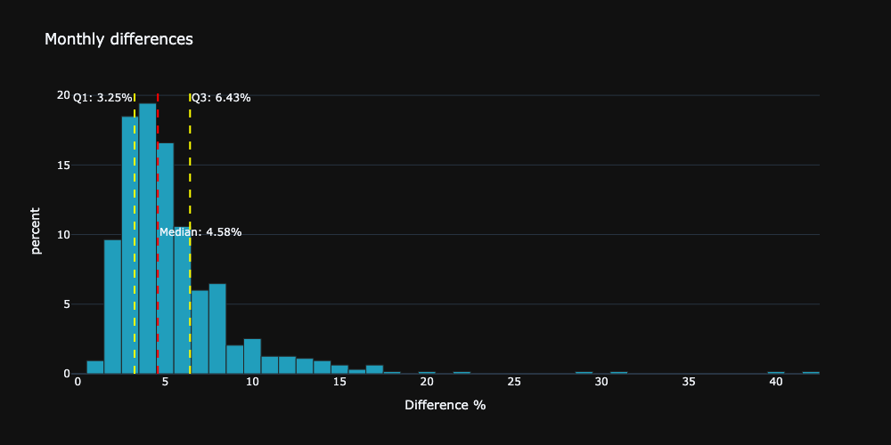

---
author:
  name: "David Meszaros"
date: 2024-09-03
linktitle: bdts
title: Best day to invest
type:
- post
- posts
weight: 10
aliases:
- /blog/best-day-to-invest/
---
# What is the best day of the month to schedule your saving plans ? 

- [What is the best day of the month to schedule your saving plans ?](#what-is-the-best-day-of-the-month-to-schedule-your-saving-plans-)
- [Inspiration](#inspiration)
- [Rules and assumptions:](#rules-and-assumptions)
- [Simulating different saving plans](#simulating-different-saving-plans)
  - [The importance of the end date](#the-importance-of-the-end-date)
- [Visualizing the distribution of the differences between the best and worst day of the month](#visualizing-the-distribution-of-the-differences-between-the-best-and-worst-day-of-the-month)
- [Day rank statistics](#day-rank-statistics)
- [Conclusions](#conclusions)

> **Disclaimer**: This project is for educational purposes only. The results are based on historical data and do not guarantee future performance. The project is not intended to provide financial advice. Always do your own research before making any investment decisions.

# Inspiration

One day, I checked my ETF savings plan and noticed that the stock price seemed higher on the days when the plan was executed. My intuition suggested that on those days, the price was higher than expected, especially compared to the previous days when it appeared to be lower. Although this perception was rather subjective and I didn’t thoroughly check all the months when my savings plan was executed, it was strange enough to make me curious. I thought it would be interesting to create a project to determine which day is the best to trigger my savings plan.

To check which is the best day to invest, I will analyze the MSCI World Index because it is a well-known and long-established index used by many ETF providers. I wanted to use the most reliable data source, which I believed would be the official MSCI [data](https://www.msci.com/end-of-day-history). However, this site only provides daily data up to 1997, which is not ideal because determining the best day of the month obviously requires daily data 🧐.

I would just skip the story how I finally found the most obvious and easiest data source for my research after many hours of deep diving into the farthest corners of the internet. We can simply use the yfinance library, which I was already familiar with, though I wasn't aware that the Yahoo API provides data on indices. With this library, we're able to retrieve historical daily data for the [MSCI World Index](https://finance.yahoo.com/quote/%5E990100-USD-STRD/history/?filter=history) dating back to the 1970s, the last 50 years, which is quite impressive. 

<!-- To work with the data, there were several necessary tasks to be taken. I would highlight one important step where I verify if the selected investment day was available in the dataset.
The assumption, that every calender day can be used between 1 and 31 to schedule the investment plan. The problem is that the selected day is probably not available in every single month, because not every day is a trading day. 
My strategy was to check if the selected day is available, if not I am using the next available day in the given month. However this works perfectly in most cases, but at the end of the month not, because if the selected day is a day which is not followed by a trading day in the same month, the next available day would be in the next month. In this case I am using the last available day in the given month.
 -->
 My plan was to simulate several saving plans with different start and end dates, and to compare the results to find out which day is the best to invest. I was curious to see if my intuition was correct, and if the day of the month really matters when it comes to investing.

 # Rules and assumptions:
 - The investment day is defined with a number between 1 and 31, which represents the day of the month.
 - If the selected day is not available in the given month, the next available day is used.
 - In case the day is greater than the last available day in the month the last available day is used, **not** the first day of the next month.
 - The investment is always 10$.
 - The investment is always made at the close price of the day.

# Simulating different saving plans

The first simulation I ran was to check the effect of the investment day for the whole dataset which includes data from every day from the last 54 years, I invested 10$ in every month.

The results from the first simulation does not really meets my expectation. As you can see in the [figure](#figure1) the difference between the minimum possible and maximum possible worth is about **5500$** which means you would have **8.36%%** more total worth if you would have invested on the first day of the  month, compared to the last day of the month. This is quite a significant difference, which seems to be matching my personal perception. However in this case Day 1 was not the most expensive day to buy, but not the cheapest either.

To get more robust results I ran the simulations for multiple time periods:

Table for 5 scenarios:

| Scenario | Start Date | End Date  | Best day | Worst day | Difference | Data                                          |
| -------- | ---------- | --------- | -------- | --------- | ---------- | --------------------------------------------- |
| 1        | Jan, 1972  | Aug, 2024 | 30       | 5         | 9.1%       |  |
| 2        | May, 1980  | May 1985  | 19       | 4         | 5.7%       |  |
| 3        | Mar, 1990  | Mar, 2005 | 8        | 29        | 4.6%       |  |
| 4        | Okt, 2000  | Okt, 2015 | 28       | 31        | 8.9%       |  |
| 5        | Jan, 2010  | Aug, 2024 | 23       | 3         | 9.1%       |  |

These results are very surprising for me, because the results are quite different. The best and worst day was in all cases different, and the order of the days seems to be random too. The difference between the best and worst day is between **4.6%** and **9.1%**. However the number of simulated periods is not enough to make a general statement.
The most surprising result for me was the the last scenario is basically the same as the first one. Obviously the total worths are different, but the shape of the graph, and the ratio between all the days are basically the same. 

Let`s see the results for 6 different scenarios, where the start of the saving plan is always different, but the end is always the same:

|   |   |   |
| -------------------------------------------------- | -------------------------------------------------- | -------------------------------------------------- |
|  |  |  |

I find it quite interesting, that the shape of each scenario is almost the same. **This means, that the day of the saving plan is rather irrelevant for the outcome. The only thing which significantly affects the results is the end date of the saving plan.** 

## The importance of the end date

To make this perception statistically more relevant I calculated the saving plans from every first day of the month from 1972 to 31.08.2024. In this we have 624 different saving plans, with varying start, and length but always with the same end. 

The plot shows all the calculations with normalized results for each day of the month. This gives me the confidence to say that the start of the saving plan is not relevant to decide which day is the best or worst day to invest. The only thing which is significantly affecting the results is the end date. 

With these findings the experimenting can be radically simplified, because no complete saving plans need to be simulated. Only the end dates needs to be used &rightarrow;  every day in a month can be used as the basis for the calculation. 

But wait a minute, what is the reason for this? Why is the end date so important, and the start date not?
If we plot the best and worst day for the time period between 1972 and 2024, we can see on the following plots that there is no really a difference between the different days. 
In these simulations every saving plan have been started on the 5th day of the month (blue) and on the 30th day of the month (orange). In the individual month there are some differences, in some cases quite big differences but on the long run the differences are equalized.

|  |  |
| ------------------------------------------------- | -------------------------------------------------------- |

 For this reason the start date is not as relevant as the end date. The differences are equalized on the long run. If we plot the distribution of the differences between the two days we get the following results:

The differences are distributed almost normally around 0, this proves the assumption that the differences are equalized on the long run.

Now we know that we can use just the individual months to get a better picture which day of the month is the best to invest, however we know now that the start of the saving plan is not relevant, so we may need to transform the question and ask: which day is the best day of the month to sell the investment?

# Visualizing the distribution of the differences between the best and worst day of the month

With using the individual days of each available month we can calculate for each month the difference between the cheapest and the most expensive day.

Most of the differences in the past 50 years are about between **3%** and **6%**.

# Day rank statistics

The day of the month is not really relevant on the long run, however I was still curious to see, which day is the best day statistically, ranking each day in every month.

I ranked each day with the [dense ranking method](https://en.wikipedia.org/wiki/Ranking#Dense_ranking_(%221223%22_ranking)). My strategy was to rank the days with the exact same closing price with the same rank, and the following day would get the next rank. This was necessary because of the basic logic of the project. If a specific day of the month, such as a weekend, is unavailable, the plan will still proceed by using the next available day in the dataset. This approach simulates a real-world savings plan.

The following plot shows the distribution of the ranks for each day of the month:

There is a noticeable pattern in the visualization. In the first half of the month, the ranks generally align with the day of the month. For example, the 1st day ranks near the top, and the 5th day ranks around 5th. This trend holds until about the 16th-17th day, where the dominant rank fades, and the ranks become more varied.

From the 25th-26th onwards, a new pattern appears, with two dominant ranks—one high and one low—showing up. This suggests that these days tend to either perform very well or quite poorly. This dual-ranking trend continues through the rest of the month.

The following table shows the statistics for each day of the month:

|               | count | mean      | std      | min | 25% | 50%  | 75%  | max  |
| ------------- | ----- | --------- | -------- | --- | --- | ---- | ---- | ---- |
| day_to_invest |       |           |          |     |     |      |      |
| 1             | 579.0 | 9.032815  | 7.077717 | 1.0 | 2.0 | 8.0  | 16.0 | 23.0 |
| 2             | 579.0 | 9.373057  | 6.792197 | 1.0 | 3.0 | 8.0  | 16.0 | 23.0 |
| 3             | 579.0 | 9.492228  | 6.534009 | 1.0 | 3.5 | 8.0  | 16.0 | 22.0 |
| 4             | 579.0 | 9.683938  | 6.254017 | 1.0 | 4.0 | 9.0  | 15.0 | 22.0 |
| 5             | 579.0 | 9.701209  | 5.990377 | 1.0 | 4.0 | 8.0  | 15.0 | 23.0 |
| 6             | 579.0 | 9.777202  | 5.891208 | 1.0 | 4.0 | 9.0  | 15.0 | 23.0 |
| 7             | 579.0 | 9.696028  | 5.834289 | 1.0 | 5.0 | 9.0  | 15.0 | 23.0 |
| 8             | 579.0 | 9.713299  | 5.668221 | 1.0 | 5.0 | 9.0  | 15.0 | 23.0 |
| 9             | 579.0 | 9.628670  | 5.374740 | 1.0 | 6.0 | 9.0  | 14.0 | 23.0 |
| 10            | 579.0 | 9.452504  | 5.053596 | 1.0 | 6.0 | 9.0  | 13.0 | 22.0 |
| 11            | 579.0 | 9.474957  | 4.885255 | 1.0 | 6.0 | 9.0  | 13.0 | 21.0 |
| 12            | 579.0 | 9.670121  | 4.884123 | 1.0 | 6.0 | 9.0  | 13.0 | 22.0 |
| 13            | 579.0 | 9.744387  | 4.774168 | 1.0 | 6.0 | 10.0 | 13.0 | 23.0 |
| 14            | 579.0 | 10.103627 | 4.849247 | 1.0 | 6.0 | 10.0 | 14.0 | 23.0 |
| 15            | 579.0 | 10.119171 | 4.920963 | 1.0 | 6.0 | 10.0 | 14.0 | 23.0 |
| 16            | 579.0 | 10.316062 | 5.109385 | 1.0 | 6.0 | 10.0 | 14.0 | 23.0 |
| 17            | 579.0 | 10.556131 | 5.170606 | 1.0 | 7.0 | 11.0 | 14.0 | 22.0 |
| 18            | 579.0 | 10.777202 | 5.223427 | 1.0 | 7.0 | 11.0 | 14.0 | 22.0 |
| 19            | 579.0 | 10.740933 | 5.267768 | 1.0 | 7.0 | 11.0 | 14.5 | 22.0 |
| 20            | 579.0 | 10.734024 | 5.304082 | 1.0 | 7.0 | 11.0 | 15.0 | 22.0 |
| 21            | 579.0 | 10.751295 | 5.479150 | 1.0 | 6.0 | 11.0 | 15.0 | 23.0 |
| 22            | 579.0 | 10.816926 | 5.542318 | 1.0 | 7.0 | 11.0 | 16.0 | 22.0 |
| 23            | 579.0 | 10.775475 | 5.727191 | 1.0 | 6.0 | 11.0 | 16.0 | 22.0 |
| 24            | 579.0 | 10.863558 | 5.760536 | 1.0 | 6.0 | 11.0 | 16.0 | 22.0 |
| 25            | 579.0 | 11.031088 | 5.992995 | 1.0 | 5.0 | 12.0 | 16.0 | 22.0 |
| 26            | 579.0 | 11.158895 | 6.147183 | 1.0 | 5.0 | 12.0 | 17.0 | 22.0 |
| 27            | 579.0 | 11.184801 | 6.341115 | 1.0 | 5.0 | 12.0 | 17.0 | 22.0 |
| 28            | 579.0 | 11.343696 | 6.287600 | 1.0 | 5.0 | 12.0 | 17.0 | 23.0 |
| 29            | 579.0 | 11.732297 | 6.464102 | 1.0 | 6.0 | 13.0 | 17.5 | 23.0 |
| 30            | 579.0 | 11.813472 | 6.795309 | 1.0 | 6.0 | 13.0 | 18.0 | 23.0 |
| 31            | 579.0 | 11.951641 | 6.845129 | 1.0 | 6.0 | 13.0 | 18.0 | 23.0 |

# Conclusions

With the [last analysis](#dayrankstat) basically my subjective perception was confirmed. The first days of the months tend to have higher stock prices than the following days. However the most important thing what I have learned, that this behavior does not effect the overall performance of the saving plan, because these differences are equalized on the long run.

*Summary:*

- The day of the month is not relevant for the outcome of the saving plan, the only thing which significantly affects the results is the end date. [(Figure 13)](#figure13).
- The differences between the best and worst day of the month are between 3% and 6% [(Figure 17)](#figure17).
- The differences between the best and worst day of the month are distributed almost normally around 0. [(Figure 16)](#figure16).
- The day of the month is not relevant on the long run, however there is a noticeable pattern in the ranks of the days of the month [(Figure 18)](#figure18).