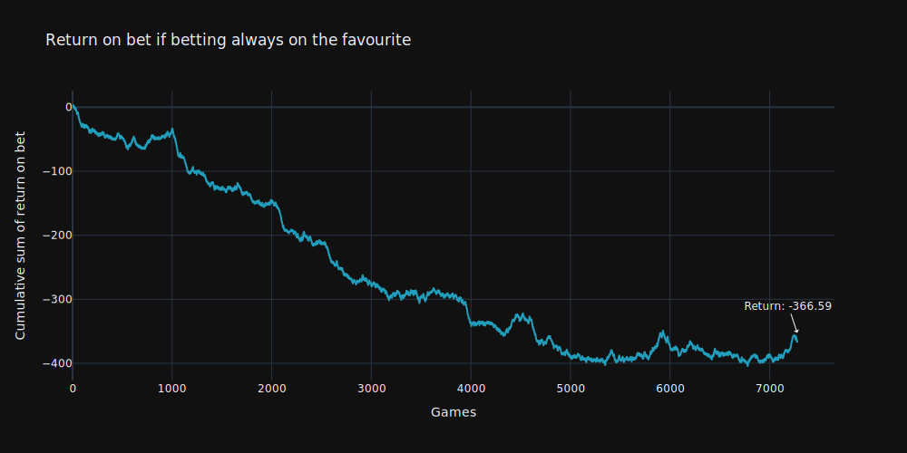
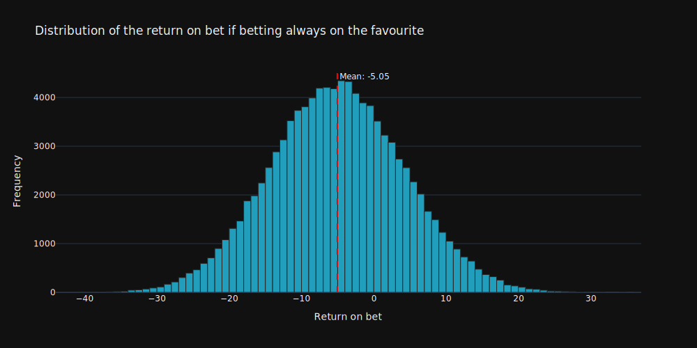
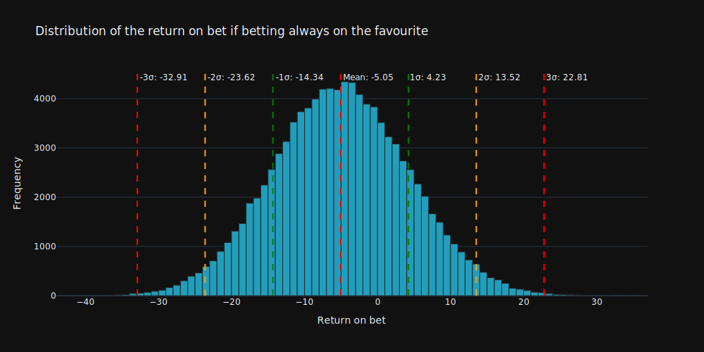

{
  "title": "Winnining by betting always on the favourite?",
  "author": {
    "name": "David Meszaros"
  },
  "date": "2024-10-17",
  "type": [
    "post",
    "posts"
  ]
}
> Disclaimer: I am not a betting expert. Please do not take this as financial advice. Do your own research before making any bets.

I did this analysis just for fun, mainly to see if always betting on the favorite would be a good strategy. Honestly, I’m not sure if it has any real value, but I was curious. I have a feeling that it wouldn’t work, since the odds are lower for the favorite, and they don’t win every time.

# Betting data

To answer the question, I collected the data for 3 different leagues:
- English Premier League
- Spanish La Liga
- German Bundesliga

The data is containing all the matches from the season **2018/2019** to **2023/2024**, overall I have 7278 matches to work with.

# Strategy

The strategy is pretty simple. I am betting always on the favorite, the strategy can be defined as follows:
- If the home team has lower odds, I bet on the home team
- If the away team has lower odds, I bet on the away team
- If the odds are the same, I bet on draw

With that said I ran the simulation for all the matches. Overall I betted **4661** times on the home team, **2510** times on the away team and **107** times on draw.

    

    

In our case the cumulative sum of the return on bet is **-366.59**, which means if we would bet always on the favorite with just 1€, we would end up with **-366.59€** loss. This is obviously a losing strategy. There are some periods where the strategy performs better, however in general the trend is negative, and you cannot make money!

# Simulate multiple series of betting

I was curious to see how the strategy performs if we try it multiple times, but with always randomly selected games. I ran a simulation 100.000 times always with 100 games. The following histogram shows very well, that the distribution follows a normal distribution with the mean around **-5**.

    

    

If we apply the emprirical rule of the [normal distribution](https://en.wikipedia.org/wiki/Normal_distribution) we can say that:
- 68% of the values are between $-1\sigma$ and $+1\sigma$, in our case between -14.34 and +4.23
- 95% of the values are between $-2\sigma$ and $+2\sigma$, in our case between -23.62 and +12.52
- 99.7% of the values are between $-3\sigma$ and $+3\sigma$, in our case between -32.91 and +22.81

    

    

# Conclusion

As expected the strategy, betting always on the favorite is a losing strategy. However I was surprised to see how much we lose on average. And If we keep betting, the losses are accumulating. With that said, I would not recommend betting always on the favorite.
