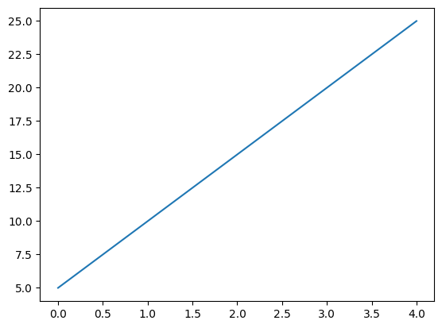

{
  "title": "This is a test to test whether the code is working or not",
  "author": {
    "name": null
  },
  "date": "2024-09-29",
  "type": [
    "post",
    "posts"
  ]
}
```python
import json

fm = {
   "cell_type": "markdown",
   "metadata": {},
   "source": [
    "---\n",
    "author:\n",
    "  name: \"David Meszaros\"\n",
    "date: 2024-09-28\n",
    "linktitle: nbc\n",
    "title: Notebook Converter\n",
    "type:\n",
    "- post\n",
    "- posts\n",
    "weight: 10\n",
    "aliases:\n",
    "- /blog/notebook-converter/\n",
    "---"
   ]
  }
```


```python
fm
```


    {'cell_type': 'markdown',
     'metadata': {},
     'source': ['---\n',
      'author:\n',
      '  name: "David Meszaros"\n',
      'date: 2024-09-28\n',
      'linktitle: nbc\n',
      'title: Notebook Converter\n',
      'type:\n',
      '- post\n',
      '- posts\n',
      'weight: 10\n',
      'aliases:\n',
      '- /blog/notebook-converter/\n',
      '---']}


```python
json.loads(fm)
```


    ---------------------------------------------------------------------------

    JSONDecodeError                           Traceback (most recent call last)

    Cell In[6], line 1
    ----> 1 json.loads(fm)


    File /opt/homebrew/Cellar/python@3.12/3.12.6/Frameworks/Python.framework/Versions/3.12/lib/python3.12/json/__init__.py:346, in loads(s, cls, object_hook, parse_float, parse_int, parse_constant, object_pairs_hook, **kw)
        341     s = s.decode(detect_encoding(s), 'surrogatepass')
        343 if (cls is None and object_hook is None and
        344         parse_int is None and parse_float is None and
        345         parse_constant is None and object_pairs_hook is None and not kw):
    --> 346     return _default_decoder.decode(s)
        347 if cls is None:
        348     cls = JSONDecoder


    File /opt/homebrew/Cellar/python@3.12/3.12.6/Frameworks/Python.framework/Versions/3.12/lib/python3.12/json/decoder.py:340, in JSONDecoder.decode(self, s, _w)
        338 end = _w(s, end).end()
        339 if end != len(s):
    --> 340     raise JSONDecodeError("Extra data", s, end)
        341 return obj


    JSONDecodeError: Extra data: line 1 column 8 (char 7)


# This is a test to test whether the code is working or not


```python
from pathlib import Path

myp = Path("parent/child.ipynb")
```


```python
import matplotlib.pyplot as plt

fig, ax = plt.subplots()

data = [5, 10, 15, 20, 25]
ax.plot(data)
plt.show()
```


    

    

