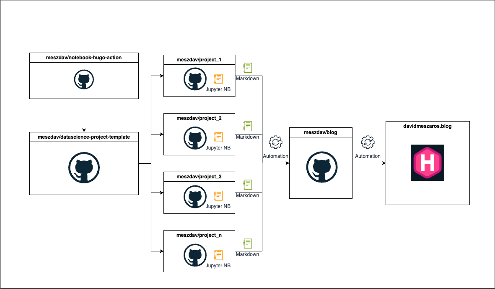

{
  "title": "Publish jupyter notebooks as blog posts",
  "author": {
    "name": "David Meszaros"
  },
  "date": "2024-10-04",
  "type": [
    "post",
    "posts"
  ]
}
I wanted to publish my data science work to a blog as easy as possible. My motivation was to do it really simple, because I want to concentrate on the data science part and not on the blog post creation. With this approach I can just have one single source of truth, which is the jupyter notebook. I can just create a notebook with all the code and explanations, and the rest is done by the workflow. This blog post which you are reading right now is also created with this approach. 🙃

## Motivation

The root of the problem, that I really like working in different repositories for each of my hobby projects. This basically means, that I am creating a new github repository for each of my data science projects. For the blog it is not ideal because the blog posts are living and should live in one single repository (I am using [Hugo](https://gohugo.io)). I could fit my workflow to the mono repository approach, where I just create an extra directory for the data science work in the blog's repository, but I don't like it 😀. I know this is pretty subjective, but  I like to keep my projects separate; I might not want to share every project, I might want specific automation for individual ones, and a monorepo could quickly grow in size, making it harder to manage.
Because I stick with the separate repository approach, I needed to find a way to publish the data science projects to the blog repository.

## The workflow

As mentioned before, my goal is to publish my hobby projects with minimal effort. The first time I published my work, I had to create a notebook with all the code and explanations just to generate the final markdown file. Afterward, I had to copy the markdown from the project’s repository to the blog repository, and I had to deploy it manually. This process is tedious and time-consuming.

The go to solution for me was to use github actions. Github actions are a great way to automate workflows, and I can implement custom actions to fit my needs.

I created a *custom github action*, which basically can be used to publish the jupyter notebooks to the blog. The advantage of this approach, that I can just create a template repository, which can be used for any future data science projects, where the required github actions are already set up. Furthermore it allows me to make changes only in the custom github action, without the need to change the action in each project repository. After setting up the data science projects, from the template repository I can just focus on creating the individual project notebooks. When I am ready to publish, I just need to push the notebook to it's repository, and the workflow will take care of the rest.

The following diagram shows the workflow of the process:



## The custom github action

As described the first step was to create a custom github action. The action needs 5 parameters:

1. `blog-gh-token`: The github token for the blog repository. This is needed to be able to push the changes to the blog repository. The token in my case is a fine-grained personal access token, which only has the permissions to push to the blog repository.
2. `notebook-path`: The path to the notebook, which we want to publish.
3. `target-repo`: The target repository. This is the repository where the hugo blog is living.
4. `target-branch`: The target branch, of the blog repository. 
5. `target-page`: This is the folder in the blog repository, where the notebook should be published.

Usage of the action:

```yaml
name: Test the custom action
on: [push]
jobs:
  publish-notebook:
    runs-on: ubuntu-latest
    steps:
      - name: Checkout repository
        uses: actions/checkout@v2

      - name: Test the action
        uses: ./
        with:
          blog-gh-token: ${{ secrets.BLOG_GH_TOKEN }}
          notebook-path: "index.ipynb"
          target-repo: "meszdav/blog"
          target-branch: "main"
          target-page: "tests"

```

After triggering the action, the following steps are executed under the hood:

#### Setting up python with `nbconvert`
`nbconvert` is used to convert the notebook to a markdown file. In hugo the content is stored in markdown format, so this is a requirement.

```yaml
    - name: Install Python and nbconvert
      shell: bash
      run: |
        python -m pip install --upgrade pip
        pip install nbconvert
```

#### Convert the notebook to a markdown file
This step is using a python script, which is located in the template repository. The python script is basically using the `nbconvert` library to convert the notebook to a markdown file. I added some custom preprocessing steps and configurations, to bring the notebook to the desired output format as markdown file.

```yaml
    - name: Convert notebooks to Markdown
      shell: bash
      run: |
        USERNAME=${{ github.actor }}
        # Make an API request using curl
        RESPONSE=$(curl -s https://api.github.com/users/$USERNAME)

        # Extract the 'name' field from the JSON response
        REAL_NAME=$(echo "$RESPONSE" | jq -r '.name')

        REPO_NAME=${{ github.repository }}
        REPO_NAME_ONLY=${REPO_NAME#*/}
        TARGET_DIR=markdowns/content/${{ inputs.target-page }}/$REPO_NAME_ONLY
        mkdir -p $TARGET_DIR

        python ${{ github.action_path }}/custom_nbconvert.py \
          --notebook_path ${{ inputs.notebook-path }} \
          --output_dir $TARGET_DIR \
          --author "$REAL_NAME"

```

In the first part of the code I am just defining some variables such as the:
- `USERNAME`: The username of the user who triggered the action
- `RESPONSE`: The response of the github api, which contains the user information
- `REAL_NAME`: The real name of the user
- `REPO_NAME`: The name of the repository with the owner
- `REPO_NAME_ONLY`: The name of the repository without the username
- `TARGET_DIR`: The target directory where the markdown file should be stored

After that I am calling the python script, which is doing the conversion.
In the script I am reading the notebook with `nbconvert` after that *front-matter* need to be added for the notebook; this is required for hugo to be able to detect the title, date, and other metadata from the notebook.

```python
def create_front_matter(notebook):
    """Creating front matter for the markdown file"""
    title = get_title(notebook)
    ts = os.path.getmtime(args.notebook_path)
    date = str(datetime.datetime.fromtimestamp(ts).date())

    # add front matter to the markdown file
    front_matter = {
        "title": title,
        "author": {"name": args.author},
        "date": date,
        "type": ["post", "posts"],
    }

    front_matter_str = json.dumps(front_matter, indent=2)

    return front_matter_str
```

In some cases there are empty cells and unnecessary whitespace in the notebook cells, to get rid of them a custom `Preprocessor` is used.

```python
class StripAndRemoveEmptyCells(Preprocessor):
    def preprocess(self, nb, resources):
        # Strip leading and trailing whitespace from all cells
        for index, cell in enumerate(nb.cells):
            nb.cells[index], resources = self.preprocess_cell(cell, resources, index)

        # Remove empty cells
        nb.cells = [cell for cell in nb.cells if cell.source]

        return nb, resources

    def preprocess_cell(self, cell, resources, index):
        # Strip leading and trailing whitespace
        cell.source = cell.source.strip()

        return cell, resources
```

If the notebook has markdown cells with referenced images, it is necessary to handle them additionally, these resources are referenced with ``. These images are not converted by `nbconvert`, so I need to take care of them. In the `handle_custom_resources` function the custom resources are added to the `resources`directory created by the `nbconvert`.

```python
def handle_custom_resources(notebook, resources):
    """Handle custom resources. In case of using custom resources with
     in the markdown file, the resource does not get converted
    with the nbconvert. This function will handle the custom resources and add them
    to the resources dictionary."""

    # Get all the images in the notebook
    images = []
    for cell in notebook.cells:
        if cell.cell_type == "markdown":
            images.extend(re.findall(r"!\[.*?\]\((.*?)\)", cell.source))

    def copy_to_resources(image_path):
        """Copy the image to the resources directory"""
        image_path = Path(image_path)
        if image_path.exists():
            with open(image_path, "rb") as f:
                resources["outputs"][image_path.name] = f.read()
        else:
            logger.warning(f"Image {image_path} not found")

    # Copy the images to the resources directory
    for image in images:
        copy_to_resources(image)

```

Plots, and images generated by python code are automatically converted by `nbconvert`, however they are added to the root level where the markdown file is stored. I wanted to organize the resources in separate folders, so I moving the resources to a separate folder.

```python
    # Update resource references in the markdown body
    if resources.get("outputs"):
        for filename in resources["outputs"].keys():
            relativ_path = str(Path("resources") / filename)
            body = body.replace(filename, relativ_path)
    # Save resources (e.g., images) if they exist
    if resources.get("outputs"):
        resources_output_dir = output_dir / "resources"

        os.makedirs(resources_output_dir, exist_ok=True)

        for filename, data in resources["outputs"].items():
            output_path = resources_output_dir / filename
            with open(output_path, "wb") as resource_file:
                resource_file.write(data)
```


With these steps the notebook is converted with all desired files. And the files can easily be moved to the target repository. (aka. blog repository)

#### Copy the notebook to the target repository
This is done by cloning the target repository in the github action and copying the converted notebook and its resources (like images) to the target branch. 

```yaml
    - name: Push markdowns to target repo
      shell: bash
      run: |
        git config --unset-all http.https://github.com/.extraheader
        git clone https://$GITHUB_TOKEN@github.com/${{ inputs.target-repo }} repo
        cp -r markdowns/* repo/
        cd repo
        git config user.name "${{ github.actor }}"
        git config user.email "${{ github.actor }}@users.noreply.github.com"
        git add .
        git commit -m "Add converted markdown files"
        git push origin ${{ inputs.target-branch }}
      env:
        GITHUB_TOKEN: ${{ inputs.blog-gh-token }}
```

If everything goes well, the notebook is coverted with all its assets and pushed to the target repository. The blog repository is set up in a way that it publishes the markdown files as blog posts in case of a push to the main branch.

## Blog repositoy

The blog repository is a normal hugo repository. I am using [netlify](https://netlify.com) to host the blog. Netlify provides some nice features to deploy the blog with CI/CD. However I decided to deploy my blog "manually" (I mean with manually that I am not using the netlify's build service) because I want to have control over the full deployment process. I am using the [netlify cli](https://cli.netlify.com/) to deploy the blog.

The deployment is pretty straightforward:

```yaml
jobs:
    build:
        runs-on: ubuntu-22.04

        steps:
        - name: Checkout repository
          uses: actions/checkout@v2

        - name: Set up Hugo
          uses: peaceiris/actions-hugo@v2
          with:
            hugo-version: "0.133.1"
            extended: true

        - name: Build Hugo site
          run: hugo

        - name: Install Netlify CLI
          run: npm install -g netlify-cli

        - name: Deploy to Netlify
          env:
            NETLIFY_AUTH_TOKEN: ${{ secrets.NETLIFY_AUTH_TOKEN }}
            NETLIFY_SITE_ID: ${{ secrets.NETLIFY_SITE_ID }}
          run: | 
            netlify deploy --prod --dir=public
```

For the deployment I needed to set up a netlify authentication token and a site id. With these two environment variables the deployment is done with only one line of code.

## Final thoughts

This approach is not perfect, but it works for me. I can live with the current solution, and it is a good starting point. In any future project, I can just create a notebook with all the code and explanations, and the workflow will take care of the rest. 

### Links

- [The custom github action](https://github.com/meszdav/notebook-hugo-action/blob/main/action.yml)
- [The blog repository](https://github.com/meszdav/blog)
