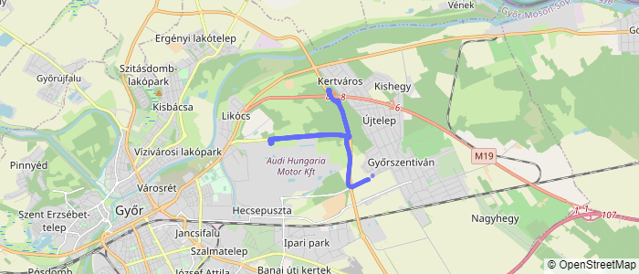
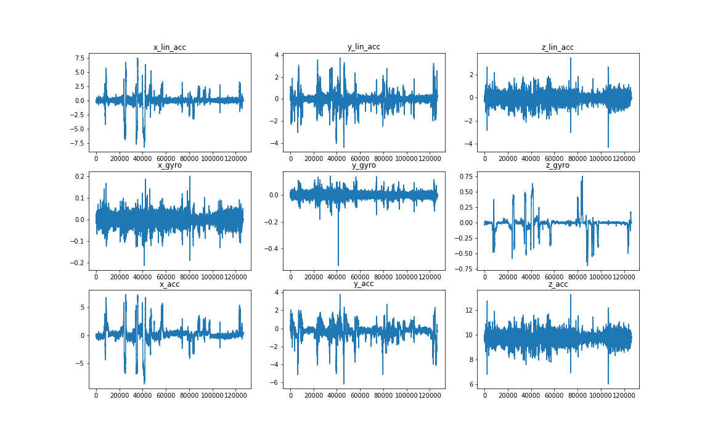
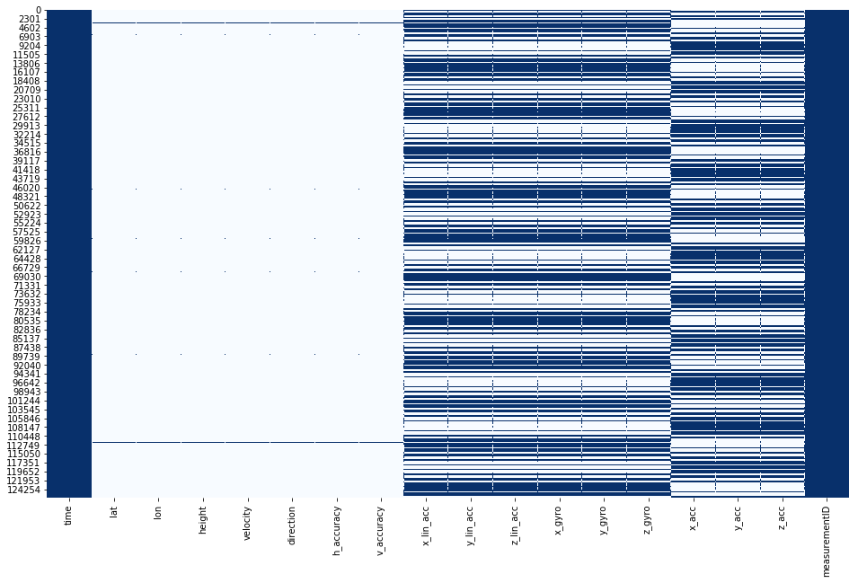

---
author:
  name: "David Meszaros"
date: 2020-09-01
linktitle: RSQ
title: Road Surface Quality using Smartphone - Project Report
type:
- post
- posts
weight: 10
aliases:
- /blog/road-surface-quality/
---


# Introduction

I live in Hungary, where the road surface quality is one of the worst in Europe. While I was on the road, I thought several times that it would be good to plan my trip depending on the road quality. In this case I could better enjoy the beauties of my country, and the trips would been more safe. Because of this, I decided to create a proof of concept in this topic.

The goal of the proof of concept is to evaluate specific road surface measurements, and plot the road surface quality to a geographical map, only using the measurement data.

The measurements have been recorded via a smart phone, and  only the accelerometer, gyroscope and gps data have been used, to classify the road surface into a quality class.

## Steps

1. Data Acquisition
2. Data Exploration and Data Processing
3. Feature Engineering
4. Data Classification and Model Evaluation
5. Hyperparameter Tuning
6. Deployment
7. Conclusion

## Data Acquisition

I decided to make this project with my own data. This means the first challenge was to acquire usable data, which I can use to train machine learning models. 

The first thing was to plan a measurement process, which I can use as a standard for recording the data.  As hardware I chose my IPhone, because this is a straight forward way to record sensory data. The smartphone is not the only hardware in order to collect data from the roads. The other hardware to collect this type of data is a vehicle. I used my car to make the measurements.

My plan was to select 3 types of roads, which I can use as training data. After thinking about a bit, I realized that to classify road surface quality into three classes I would need much more data and experimenting.  So I discarded the idea, and I decided to classify the road surfaces into two categories; good and bad. 

This is a very subjective way to select labeled data, but as a proof of concept it worked perfectly.  

For **quality 1** I selected the following route in Hungary where I live:



Figure 1: Best quality road surface

For the **quality 2** road surface I selected roads with significant dameges. 

.png)

Figure 3: Bad quality road surface.

These routes will be the dataset in order to train, validate and test the machine learning models.

For testing purposes I selected another route, which I can use to test the best model with data which is fully unknown for the model. This route will have good and bad road surfaces as well.

.png)

Figure 4: Test route for road surface classification

As record instrument I used the phyphox application. This application is able to record all of the signals from the smart phone. This is perfect for my purposes. The sample rate for the accelerometer and the gyroscope is 50Hz, which is very good for this use case. But the sample rate for the GPS is only 1s. (and the sample rate not constant). The output of the measurements are comma separated csv file. In the output file there are 4 csv-s, and each csv belongs to a sensor. 

# Data Exploration and Processing

First of all I wanted to see the data from the accelerometers and gyroscope. These signals are going to help to classify the road surfaces. To do so I separately read in the data, and then I plotted the signals vs the time. 



Figure 5: Time signals form the accelerometers and gyroscope

The sensory data seems to be right. There are no bigger gaps in the signal nor unrealistic behaviour of the time signal. (e.g.: 0 values or stationary parts)

After the check of the time signals, the next task was to read in all the data in a proper way. The phyphox application creates 4 csv files for each signal. Which is great if we would like to work with the signals separately. But in this case we need to handle all signals together. I wrote a function to merge all signals to a file. After the merge  I had the following column names:

```markdown
time - time points of the measurements [s]
lat - Latitude [°]
lon - Longitude [°]
height - Height above sea level [m]
velocity - Velovity [m/s]
direction - Direction [°]
h_accuracy - Accuracy of the horizontal coordinate
v_accuracy - Accuracy of the vertical ccordinate
x_lin_acc - Linear acceleration of the x axis
y_lin_acc - Linear acceleration of the y axis
z_lin_acc - Linear acceleration of the z axis
x_gyro - Gyroscope x axis
y_gyro - Gyroscope y axis
z_gyro - Gyroscope z axis
x_acc - Accelrometer x axis
y_acc - Accelrometer x axis
z_acc - Accelrometer x axis
measurementID - Id of the measurement
```

 

Here I have all neccessery columns to start to work with. However the signals have been recorded at the same time, the time points in the 4 separate files are different. This means, that after the merge of the measurements, there are data points where we have only information about one sensor. To check how different they are I made some data exploration on the dataframe.  

I checked the ratio of the *NaN*  values in all signals:

```
time             0.000000
lat              0.995014
lon              0.995014
height           0.995014
velocity         0.995014
direction        0.995014
h_accuracy       0.995014
v_accuracy       0.995014
x_lin_acc        0.502548
y_lin_acc        0.502548
z_lin_acc        0.502548
x_gyro           0.502548
y_gyro           0.502548
z_gyro           0.502548
x_acc            0.502430
y_acc            0.502430
z_acc            0.502430
measurementID    0.000000
dtype: float64
```

It easy to see, that the na values in each column is really high. The smallest amount of *NaN* values have the accelerometers and the gyroscope, but the gps signals have a large amount of *NaN*  values. To see visually where are those missing values I plotted out a heatmap. (**blues** for values and the **whites** for the *NaNs*):



Figure 6: Distribution of the *NaN* values in the dataframe

The explanation for this, the sample rate of the measurement. The data points have been not recorded at the same time for the different sensors as I waited. For example there were no data  recorded for the accelerometer where the data have been recorded for the gyroscope and vice versa. This means as well, that the dropping out of the *NaN*  values is not a solution for this problem. If we would do so, then we lost all data point from one or more  sensors. In order to take care of this missing values I worked out the following data processing steps: 

1. Correcting timestamps 
    
    <aside>
    💡 This step was neccessary, because the time spent between the recorded data points were not equal.  I grouped each data point regarding to the desired sample rate.
    
    </aside>
    
2. Making time groups
    
    <aside>
    💡 After the first step, there were some repeating values because of the grouping. In order to avoid from the repeating values, I grouped each value regarding to a specific time value.
    
    </aside>
    
3. Interploate timestamps
    
    <aside>
    💡 Interpolating the time stamps is necessary, if remained such time points, where the time gap is bigger than the desired sample rate.
    
    </aside>
    

After these steps the *NaN* values have been from the accelerometers and the gyroscope eliminated. With the *NaNs* in the gps signals I will take care of in a later step.


Figure 7: Distribution of the *NaNs* after the dataprocessing steps.

These steps make possible to do feature engineering, which is the key part of the data processing. 

# Feature Engineering

The datasets in the previously  described form is not appropriate for the corresponding machine learning model training. If we use the data in this form, we would do classification for each data point.  But what does one data point mean? One data point has the information about the road surface only in one moment which not describes the property of a part. In order to have a better description of a specific part of the road, we need to examine bigger part of the measurement. This means we need to aggregate the data according to some parameter. 

I selected as my aggregation paremter the gps coordinates. I have one gps record in every seconds, this means I will examine a statistic from all data point in every seconds. And this statistics will be my features for the machine learning algorithm.

I aggregated the time series data for every seconds with the following functions:

```markdown
sum - sum of the values
mean - sum of the values
mad - mean absolute deviation of the values
median - meadian of the values
min - minimum of the values
max - maximum of the values
std - sample standard deviation
var - unbiased variance
sem - unbiased standard error of the mean
skew - unbiased skew
quantile - values at the given quantile
kurtosis_time - kurtosis of the values
rms_100 - root mean squer of the values
crest - crest factor of the values
```

To do so I wrote a function which take care of all data aggregation along the gps coordinates.

After the data aggregation, the resulted dataframe have 14[aggregation function] x 9[sensors] (126) new features to work with.

Now the data is prepared for the machine learning steps. But before the classification part let see how the data looks like.

Number of *NaNs: 0*

Number of features: 126

Labels distribution: 

There are 561 records for the  label 0 and 540 for the label 1. This means all class is representative in the dataset.

.png)

Figure 8: Label Distribution

To prepare the data for machine learning I splitted the data into train, validation and test set. In the first step I splitted the 70% of the data to train set and the 20% of the data to validation set. After that I used the  splitted train set for further splitting. At the and I had following three splits:

```markdown
train:  704 records
val:  221 records
test:  176 records

```

With these steps I could evaluate my model with data which have been not seen by the model.

# Data Classification and Model Evaluation

## Model

The described task is a classification problem. To classify the data we can use supervised learning algorithms. I used the scikit learn library as my tool. In the library there are several classification algorithms which can do the job. I wanted to find the best technique for my purposes, that is why I tested 6 algorithms. I chose the following algorithms:

 

- Random Frorest Classifier (rfc)
- Support Vector Classification (svc)
- K-Neighbors Classifier (knc)
- AdaBoost Classifier (abc)
- Gradient Boosting Classifier (gbc)
- Gaussian Naive Bayes (gnb)

My expectation was that the svc or the rfc performs the best. There are some papers, where the Support Vector Classification have been used to classify road surface data [1,2]

1.: [https://ieeexplore.ieee.org/document/6485514](https://ieeexplore.ieee.org/document/6485514)

2.: [https://www.semanticscholar.org/paper/An-SVM-based-Algorithm-for-Road-Disease-Detection-Ren-Wen/279180bff3ef77d8cb23f0fb56075f61bc291013](https://www.semanticscholar.org/paper/An-SVM-based-Algorithm-for-Road-Disease-Detection-Ren-Wen/279180bff3ef77d8cb23f0fb56075f61bc291013)

## Metrics

As my main metric to evaluate the model I chose the accuracy score. The accuracy score can be calculated as the sum of the true positive and true negative values divided by the total number of the samples. This score works only if the data is well balanced, this means that the number of each label should be almost the same. This is perfect for this usecase, because the number of  the label 0, and 1 is almost the same and so the accuracy score  is a representative evaluating metrics.  

I trained all models on the training data. And with the basic parameters I got the following results.


The best accuracy belongs to the Random Forest Classifier and to the Gradient Boosting Classifier. In the cross validation the smaller delta (max score - min score) value belongs to the Random Forest Classifier, this means the model is more robust, and performs better with unknown data. The AdaBoost classifier performs pretty good as well, but the robustness and the accuracy score sightly below of the Random Forest and Gradient Boosting classifiers. The performance of KNeighbors classifier is worse than the previous methods. The Support Vector classifier performs the worst, this model classifies all record with label 1, this means the model cannot make difference between the classes.

If we examine the confusion matrix of these two classifier we can see, that the  RFC and the SVC make the same mistakes.  That is why I decided to make hyperparameter tuning for both algorithms.


Figure 8: Confusion matrix of the Random Forest Classifier


Figure 9: Confusion Matrix of the Gradient Boost Classifier

# Hyperparameter Tuning

For the hyperparameter tuning of the rfc I selected the following  paramters:

```python
params = {
        "min_samples_leaf": [1, 2, 4],
        "min_samples_split": [2, 4, 12],
        "n_estimators": [100, 400, 800]
}

rfc_search = GridSearchCV(
    estimator=rfc, 
    param_grid=params, 
    scoring="accuracy",
)

rfc_search.fit(X_train, y_train)
```

And for the gbc:

```python
params = {
        "learning_rate": [0.1, 2, 4],
        "min_samples_leaf": [1, 4, 8],
        "min_samples_split": [2, 4, 8],
        "n_estimators": [100, 200, 400]
}

gbc_search = GridSearchCV(
    estimator=gbc, 
    param_grid=params,
    scoring="accuracy",
)

gbc_search.fit(X_train, y_train)
```

After the hyperparameter tuning the summary:


After the hyperparameter tuning the accuracy score was not better. Because of the training speed and the better cross validation delta score, I selected the Random Forest Classifier as my final model. The final accuracy of the Random Forest Classifier was 0.977376. The training speed was for the rfc: 1,9s and for the gbc 2,9s.

To examine the accuracy visually I plotted out the training data sets, which have been classified by the trained algorithm. Normally it is not best way to represent the results, but in this case it can be a good choice because while the training the data set was shuffled. In this case I read the labels separately, this means the model saw the data in this form firstly.

.png)

Figure 10: Training data for good quality road surface

.png)

Figure 11: Training data for bad quality road surface

.png)

Figure 12: Unknown data classified by the Random Forest Classifier as Proof of Concept

# Deployment

I build a plotly dash application to interactively visualize the data classification. This application can be easily deployed with the help of Amazon Beanstalk or with Heroku. With the application it is possible to upload only a zip file which is coming from directly the phyphox application. After the upload we need to wait just a few seconds and the classification is happening. Every  recorded gps coordinate will be classified to a road surface quality class.


Figure 13: Screenshot from the dash application

# Conclusion

I created this project as a proof of concept. The results exceeded my expectations. However I used only smartphone data the classification accuracy was above 97%. There are manny part of the project where it can be optimized. With the collection of more training data from more type of road surfaces, the method can be more better and more versatile.  There are many oportunities to develop the theory, with more data it could be build a database and the road surface data could be monitored not only in one city, but even in a whole country...