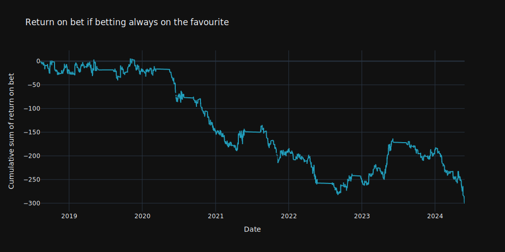
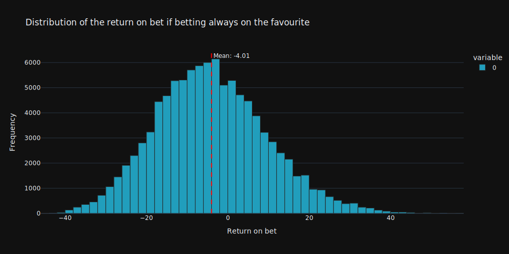

{
  "title": "Winnining by betting always on the favourite?\n\n> Disclaimer: I am not a betting expert. Please do not take this as financial advice. Do your own research before making any bets.\n\n\nI did this analysis just for fun. I am not sure if it has any practical value, however I was just curious to see if betting always on the favourite would be a good strategy.\nMy intuitive answer would be to the question, that it cannot be a good strategy, because the odds are always lower for the favourite, and the favourite does not win every time. \n\n# Betting data\n\nTo answer the question, I collected the data for 3 different leagues:\n- English Premier League\n- Spanish La Liga\n- German Bundesliga\n\nThe data is containing all the matches from the season **2018/2019** to **2023/2024**.",
  "author": {
    "name": "David Meszaros"
  },
  "date": "2024-10-11",
  "type": [
    "post",
    "posts"
  ]
}
The data which I used looks like this:


<div><style>
.dataframe > thead > tr,
.dataframe > tbody > tr {
  text-align: right;
  white-space: pre-wrap;
}
</style>
<small>shape: (5, 21)</small><table border="1" class="dataframe"><thead><tr><th>id</th><th>home</th><th>away</th><th>home-name</th><th>away-name</th><th>sport-id</th><th>date-start-timestamp</th><th>result</th><th>homeResult</th><th>awayResult</th><th>home-winner</th><th>away-winner</th><th>postmatchResult</th><th>country-id</th><th>country-name</th><th>1_avg_odds</th><th>x_avg_odds</th><th>2_avg_odds</th><th>1_max_odds</th><th>x_max_odds</th><th>2_max_odds</th></tr><tr><td>i64</td><td>i64</td><td>i64</td><td>str</td><td>str</td><td>i64</td><td>i64</td><td>str</td><td>str</td><td>str</td><td>str</td><td>str</td><td>str</td><td>i64</td><td>str</td><td>f64</td><td>f64</td><td>f64</td><td>f64</td><td>f64</td><td>f64</td></tr></thead><tbody><tr><td>3263915</td><td>8002902</td><td>8002903</td><td>&quot;Liverpool&quot;</td><td>&quot;Manchester City&quot;</td><td>1</td><td>1538926200</td><td>&quot;0:0&quot;</td><td>&quot;0&quot;</td><td>&quot;0&quot;</td><td>&quot;draw&quot;</td><td>&quot;draw&quot;</td><td>&quot;0:0&quot;</td><td>198</td><td>&quot;England&quot;</td><td>2.75</td><td>3.6</td><td>2.6</td><td>2.75</td><td>3.6</td><td>2.6</td></tr><tr><td>3263917</td><td>8002906</td><td>8002907</td><td>&quot;Southampton&quot;</td><td>&quot;Chelsea&quot;</td><td>1</td><td>1538918100</td><td>&quot;0:3&quot;</td><td>&quot;0&quot;</td><td>&quot;3&quot;</td><td>&quot;lost&quot;</td><td>&quot;win&quot;</td><td>&quot;0:3&quot;</td><td>198</td><td>&quot;England&quot;</td><td>6.5</td><td>4.2</td><td>1.57</td><td>6.5</td><td>4.2</td><td>1.57</td></tr><tr><td>3263913</td><td>8002898</td><td>8002899</td><td>&quot;Fulham&quot;</td><td>&quot;Arsenal&quot;</td><td>1</td><td>1538910000</td><td>&quot;1:5&quot;</td><td>&quot;1&quot;</td><td>&quot;5&quot;</td><td>&quot;lost&quot;</td><td>&quot;win&quot;</td><td>&quot;1:5&quot;</td><td>198</td><td>&quot;England&quot;</td><td>5.0</td><td>4.4</td><td>1.66</td><td>5.0</td><td>4.4</td><td>1.66</td></tr><tr><td>3263916</td><td>8002904</td><td>8002905</td><td>&quot;Manchester Utd&quot;</td><td>&quot;Newcastle&quot;</td><td>1</td><td>1538843400</td><td>&quot;3:2&quot;</td><td>&quot;3&quot;</td><td>&quot;2&quot;</td><td>&quot;win&quot;</td><td>&quot;lost&quot;</td><td>&quot;3:2&quot;</td><td>198</td><td>&quot;England&quot;</td><td>1.4</td><td>4.75</td><td>10.0</td><td>1.4</td><td>4.75</td><td>10.0</td></tr><tr><td>3263911</td><td>8002894</td><td>8002895</td><td>&quot;Burnley&quot;</td><td>&quot;Huddersfield&quot;</td><td>1</td><td>1538834400</td><td>&quot;1:1&quot;</td><td>&quot;1&quot;</td><td>&quot;1&quot;</td><td>&quot;draw&quot;</td><td>&quot;draw&quot;</td><td>&quot;1:1&quot;</td><td>198</td><td>&quot;England&quot;</td><td>2.35</td><td>3.0</td><td>3.8</td><td>2.35</td><td>3.0</td><td>3.8</td></tr></tbody></table></div>


In the data we have all necessary information to calculate the return on bet. However the data needed to be cleaned and transformed before it can be used.

The following preprocessing steps were applied:
1. Removes specified columns
2. Converts timestamp to datetime
3. Adds a winner column
4. Maps the winner column to numeric values
5. Converts result columns to integers

After transforming the data, the table looks like this:


<div><style>
.dataframe > thead > tr,
.dataframe > tbody > tr {
  text-align: right;
  white-space: pre-wrap;
}
</style>
<small>shape: (5, 17)</small><table border="1" class="dataframe"><thead><tr><th>home</th><th>away</th><th>home-name</th><th>away-name</th><th>result</th><th>homeResult</th><th>awayResult</th><th>home-winner</th><th>away-winner</th><th>1_avg_odds</th><th>x_avg_odds</th><th>2_avg_odds</th><th>date</th><th>winner</th><th>winner_num</th><th>home_result</th><th>away_result</th></tr><tr><td>i64</td><td>i64</td><td>str</td><td>str</td><td>str</td><td>str</td><td>str</td><td>str</td><td>str</td><td>f64</td><td>f64</td><td>f64</td><td>datetime[μs]</td><td>str</td><td>i64</td><td>i32</td><td>i32</td></tr></thead><tbody><tr><td>8002902</td><td>8002903</td><td>&quot;Liverpool&quot;</td><td>&quot;Manchester City&quot;</td><td>&quot;0:0&quot;</td><td>&quot;0&quot;</td><td>&quot;0&quot;</td><td>&quot;draw&quot;</td><td>&quot;draw&quot;</td><td>2.75</td><td>3.6</td><td>2.6</td><td>2018-10-07 15:30:00</td><td>&quot;draw&quot;</td><td>0</td><td>0</td><td>0</td></tr><tr><td>8002906</td><td>8002907</td><td>&quot;Southampton&quot;</td><td>&quot;Chelsea&quot;</td><td>&quot;0:3&quot;</td><td>&quot;0&quot;</td><td>&quot;3&quot;</td><td>&quot;lost&quot;</td><td>&quot;win&quot;</td><td>6.5</td><td>4.2</td><td>1.57</td><td>2018-10-07 13:15:00</td><td>&quot;away&quot;</td><td>2</td><td>0</td><td>3</td></tr><tr><td>8002898</td><td>8002899</td><td>&quot;Fulham&quot;</td><td>&quot;Arsenal&quot;</td><td>&quot;1:5&quot;</td><td>&quot;1&quot;</td><td>&quot;5&quot;</td><td>&quot;lost&quot;</td><td>&quot;win&quot;</td><td>5.0</td><td>4.4</td><td>1.66</td><td>2018-10-07 11:00:00</td><td>&quot;away&quot;</td><td>2</td><td>1</td><td>5</td></tr><tr><td>8002904</td><td>8002905</td><td>&quot;Manchester Utd&quot;</td><td>&quot;Newcastle&quot;</td><td>&quot;3:2&quot;</td><td>&quot;3&quot;</td><td>&quot;2&quot;</td><td>&quot;win&quot;</td><td>&quot;lost&quot;</td><td>1.4</td><td>4.75</td><td>10.0</td><td>2018-10-06 16:30:00</td><td>&quot;home&quot;</td><td>1</td><td>3</td><td>2</td></tr><tr><td>8002894</td><td>8002895</td><td>&quot;Burnley&quot;</td><td>&quot;Huddersfield&quot;</td><td>&quot;1:1&quot;</td><td>&quot;1&quot;</td><td>&quot;1&quot;</td><td>&quot;draw&quot;</td><td>&quot;draw&quot;</td><td>2.35</td><td>3.0</td><td>3.8</td><td>2018-10-06 14:00:00</td><td>&quot;draw&quot;</td><td>0</td><td>1</td><td>1</td></tr></tbody></table></div>


# Betting strategy

I decided to build a class for the betting strategy, which can be easily reused and adjusted, for different strategies. However the analysis of different strategies is out of scope of this post. Let`s focus on the most simple strategy, which is betting always on the favourite.

```python

from abc import ABC, abstractmethod


class BettingStrategy(ABC):
    def __init__(self, df: pl.DataFrame, target_columns: list[str]):
        self.df = df
        self.target_columns = target_columns

    @abstractmethod
    def add_bet(self, df: pl.DataFrame) -> pl.DataFrame:
        """
        Add a column to the dataframe which will be the bet number (1, 0 or 2)
        """
        pass

    def add_bet_won_column(self, df):
        """
        Add a column to the dataframe which will be True if the bet has won.
        """
        return df.with_columns(bet_won=pl.col("winner_num").eq(pl.col("bet")))

    def add_odds_to_use(self, df):
        """
        Add a column to the dataframe which will be the odds to use for the bet.
        """
        return df.with_columns(
            odds_to_use=pl.when(pl.col("winner_num").eq(1))
            .then(pl.col("1_avg_odds"))
            .when(pl.col("winner_num").eq(2))
            .then(pl.col("2_avg_odds"))
            .otherwise(pl.col("x_avg_odds"))
        )

    def calculate_return(self, df):
        """
        Add a column to the dataframe which will be the return on the bet.
        """
        return df.with_columns(
            return_on_bet=pl.when(pl.col("bet_won"))
            .then(pl.col("odds_to_use") - 1)
            .otherwise(pl.lit(-1))
        )

    def get_underdog(self, df):
        """
        Add a column to the dataframe which will be the underdog team (1=home, 2=away, or None)
        """
        return df.with_columns(
            underdog=pl.when(pl.col("1_avg_odds") < pl.col("2_avg_odds"))
            .then(pl.lit(2))
            .when(pl.col("2_avg_odds") < pl.col("1_avg_odds"))
            .then(pl.lit(1))
            .otherwise(pl.lit(None))
        )

    def get_favourite(self, df):
        """
        Add a column to the dataframe which will be the favourite team (1=home, 2=away, or None)
        """
        return df.with_columns(
            favourite=pl.when(pl.col("1_avg_odds") < pl.col("2_avg_odds"))
            .then(pl.lit(1))
            .when(pl.col("2_avg_odds") < pl.col("1_avg_odds"))
            .then(pl.lit(2))
            .otherwise(pl.lit(None))
        )

    def has_favourite_won(self, df):
        """
        Add a column to the dataframe which will be True if the favourite has won.
        """
        return df.with_columns(
            has_favourite_won=pl.col("favourite").eq(pl.col("winner_num"))
        )

    def has_underdog_won(self, df):
        """
        Add a column to the dataframe which will be True if the underdog has won.
        """
        return df.with_columns(
            has_underdog_won=pl.col("underdog").eq(pl.col("winner_num"))
        )

    def apply_strategy(self):
        """
        Apply the strategy to the dataframe.
        """
        prep_df = (
            self.df.pipe(self.get_underdog)
            .pipe(self.get_favourite)
        )
        bet_df = self.add_bet(prep_df)

        # check if the method has been implemented correctly
        if "bet" not in bet_df.columns:
            raise ValueError(
                "The add_bet method has not been implemented correctly."
                "Please add a column called 'bet'."
            )

        # check if the bet column only contains 1, 0 or 2
        required_bet_values = set([1, 0, 2])
        if not bet_df["bet"].is_in(required_bet_values).all():
            raise ValueError(
                "The add_bet method has not been implemented correctly."
                f"Please add a column called 'bet' with the values {required_bet_values}."
            )

        return (
            bet_df.pipe(self.add_bet_won_column)
            .pipe(self.add_odds_to_use)
            .pipe(self.has_favourite_won)
            .pipe(self.has_underdog_won)
            .pipe(self.calculate_return)

        )
```

The class which I defined is an abstract class, which means that it cannot be instantiated directly. However it can be used as a base class for other strategies. There are multiple methods which are common for all strategies, like the `add_bet_won_column` or the `calculate_return` method. However the `add_bet` method is abstract and has to be implemented in the subclass every time. With the help of the abstract class, we can define the `BetAlwaysOnFavourite` strategy like this:
```python
class BetAlwaysOnFavourite(BettingStrategy):
    def add_bet(self, df: pl.DataFrame) -> pl.DataFrame:
        return df.with_columns(bet=pl.lit(1))
```
As you can see the implementation is straightforward, only the `add_bet` method needs to be implemented. In some complicated strategies it is might necessary to implement other methods as well.

Applying the strategy to the data:

```python

betting_strategy = BetAlwaysOnFavourite(df, target_columns)
result = betting_strategy.apply_strategy()
```

We will get the following result:


<div><style>
.dataframe > thead > tr,
.dataframe > tbody > tr {
  text-align: right;
  white-space: pre-wrap;
}
</style>
<small>shape: (5, 25)</small><table border="1" class="dataframe"><thead><tr><th>home</th><th>away</th><th>home-name</th><th>away-name</th><th>result</th><th>homeResult</th><th>awayResult</th><th>home-winner</th><th>away-winner</th><th>1_avg_odds</th><th>x_avg_odds</th><th>2_avg_odds</th><th>date</th><th>winner</th><th>winner_num</th><th>home_result</th><th>away_result</th><th>underdog</th><th>favourite</th><th>bet</th><th>bet_won</th><th>odds_to_use</th><th>has_favourite_won</th><th>has_underdog_won</th><th>return_on_bet</th></tr><tr><td>i64</td><td>i64</td><td>str</td><td>str</td><td>str</td><td>str</td><td>str</td><td>str</td><td>str</td><td>f64</td><td>f64</td><td>f64</td><td>datetime[μs]</td><td>str</td><td>i64</td><td>i32</td><td>i32</td><td>i32</td><td>i32</td><td>i32</td><td>bool</td><td>f64</td><td>bool</td><td>bool</td><td>f64</td></tr></thead><tbody><tr><td>8002902</td><td>8002903</td><td>&quot;Liverpool&quot;</td><td>&quot;Manchester City&quot;</td><td>&quot;0:0&quot;</td><td>&quot;0&quot;</td><td>&quot;0&quot;</td><td>&quot;draw&quot;</td><td>&quot;draw&quot;</td><td>2.75</td><td>3.6</td><td>2.6</td><td>2018-10-07 15:30:00</td><td>&quot;draw&quot;</td><td>0</td><td>0</td><td>0</td><td>1</td><td>2</td><td>1</td><td>false</td><td>3.6</td><td>false</td><td>false</td><td>-1.0</td></tr><tr><td>8002906</td><td>8002907</td><td>&quot;Southampton&quot;</td><td>&quot;Chelsea&quot;</td><td>&quot;0:3&quot;</td><td>&quot;0&quot;</td><td>&quot;3&quot;</td><td>&quot;lost&quot;</td><td>&quot;win&quot;</td><td>6.5</td><td>4.2</td><td>1.57</td><td>2018-10-07 13:15:00</td><td>&quot;away&quot;</td><td>2</td><td>0</td><td>3</td><td>1</td><td>2</td><td>1</td><td>false</td><td>1.57</td><td>true</td><td>false</td><td>-1.0</td></tr><tr><td>8002898</td><td>8002899</td><td>&quot;Fulham&quot;</td><td>&quot;Arsenal&quot;</td><td>&quot;1:5&quot;</td><td>&quot;1&quot;</td><td>&quot;5&quot;</td><td>&quot;lost&quot;</td><td>&quot;win&quot;</td><td>5.0</td><td>4.4</td><td>1.66</td><td>2018-10-07 11:00:00</td><td>&quot;away&quot;</td><td>2</td><td>1</td><td>5</td><td>1</td><td>2</td><td>1</td><td>false</td><td>1.66</td><td>true</td><td>false</td><td>-1.0</td></tr><tr><td>8002904</td><td>8002905</td><td>&quot;Manchester Utd&quot;</td><td>&quot;Newcastle&quot;</td><td>&quot;3:2&quot;</td><td>&quot;3&quot;</td><td>&quot;2&quot;</td><td>&quot;win&quot;</td><td>&quot;lost&quot;</td><td>1.4</td><td>4.75</td><td>10.0</td><td>2018-10-06 16:30:00</td><td>&quot;home&quot;</td><td>1</td><td>3</td><td>2</td><td>2</td><td>1</td><td>1</td><td>true</td><td>1.4</td><td>true</td><td>false</td><td>0.4</td></tr><tr><td>8002894</td><td>8002895</td><td>&quot;Burnley&quot;</td><td>&quot;Huddersfield&quot;</td><td>&quot;1:1&quot;</td><td>&quot;1&quot;</td><td>&quot;1&quot;</td><td>&quot;draw&quot;</td><td>&quot;draw&quot;</td><td>2.35</td><td>3.0</td><td>3.8</td><td>2018-10-06 14:00:00</td><td>&quot;draw&quot;</td><td>0</td><td>1</td><td>1</td><td>2</td><td>1</td><td>1</td><td>false</td><td>3.0</td><td>false</td><td>false</td><td>-1.0</td></tr></tbody></table></div>


In the last column of the table we can see the return on the bet. The sum of this column shows the total return on the bet if we would bet always on the favourite.
In our case the sum of the return on bet is **-300.87** which means if we would bet always on the favourite with just 1€ we would end up with **-300.87€**. This is obviously a losing strategy.

Furthermore we can just plot the cumulative sum of the return see how the strategy performs over time:


    

    


There are some periods where the strategy performs better, however in general the trend is negative, and you cannot make money!

# Statistics

I was curious to see how performs strategy performs if we try it multiple times but with always other part of the data. To do so I created a function which runs the selected strategy multiple times with random games.


```python

def run_strategy_n_times(
    strategy: BettingStrategy, df: pl.DataFrame, n_times: int, n_games: int, target_columns: list[str]
) -> list[float]:
    """
    Run a betting strategy multiple times on randomly sampled subsets of data.

    This function applies a given betting strategy to randomly sampled subsets of the input
    DataFrame multiple times and returns a list of the total returns for each run.

    Args:
        strategy (BettingStrategy): The betting strategy class to be applied.
        df (pl.DataFrame): The input DataFrame containing the full dataset of games and their information.
        n_times (int): The number of times to run the strategy.
        n_games (int): The number of games to sample for each run of the strategy.
        target_columns (list[str]): The target columns to be used in the strategy.

    Returns:
        list[float]: A list containing the total return on bets for each run of the strategy.

    Notes:
        - The function uses random sampling with replacement, so the same game may appear
          multiple times in a single run or across different runs.
        - The 'target_columns' variable is assumed to be defined in the outer scope.
    """
    results = []
    for i in range(n_times):
        result = strategy(
            df.sample(n_games, shuffle=True), target_columns
        ).apply_strategy()
        results.append(result["return_on_bet"].sum())
    return results
```

Let`s run the strategy 100.000 times with 100 random games:

If we plot the results we can see the distribution of the returns:


    

    


With the simulation we get a nearly normal distribution, where the mean is -4.01. This is the expected value for the return on bet if we would bet always on the favourite, after 100 games.

# Conclusion

As expected the strategy, betting always on the favourite is a losing strategy. However I was suprised to see how much we lose on average. And If we keep betting, the losses are accumulating. With that said, I would not recommend betting always on the favourite.
