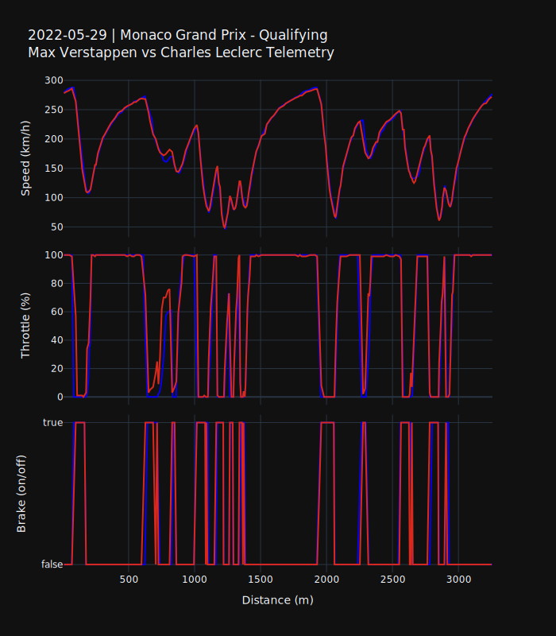
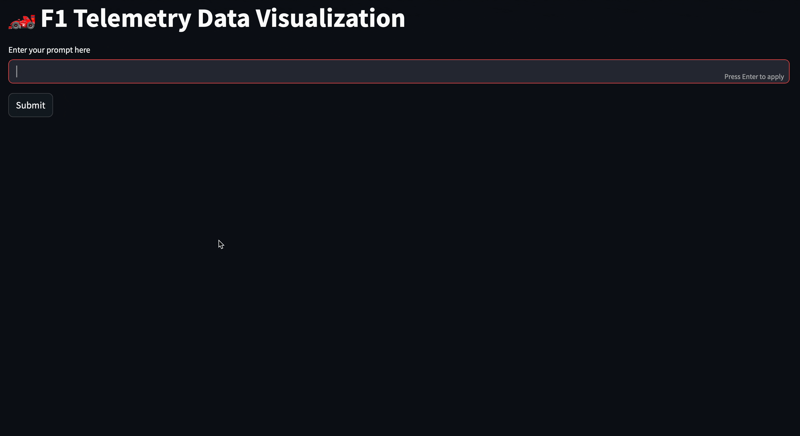

{
  "title": "\ud83e\udd1f LLM-s for F1 Telemetry Data \ud83c\udfce\ufe0f",
  "author": {
    "name": "David Meszaros"
  },
  "date": "2025-05-01",
  "type": [
    "post",
    "posts"
  ]
}
Disclaimer:
> This is my first LLM project, where I wanted to learn and explore the basics of LLMs. I decided to go with LangChain as the main framework, as it is well-documented and supports basically all types of features required for working with LLMs.

## Project Idea

The idea was fairly simple: I wanted to build a dashboard where the user can use natural language to get telemetry data from two racers for a given event. The telemetry data is time-series data that shows the speed, throttle, and brake of the car. 

One of my most important criteria was that I wanted to use real data, not data generated or hallucinated by the LLM. For this reason, my strategy was to develop custom functions that can be used to collect publicly available telemetry data.

You might ask the question: how is this better than just using conventional dropdowns or radio buttons to filter the data? This is a good question, which I asked myself too 😀. Considering that the user uses natural language, the definition of the prompt can be implicit, like asking for the `first` and the `fourth` best racer from a Grand Prix. The LLM can use tools to find these drivers and then fetch the results. Or you can describe an event just by a country or city without specifying the event exactly. This gives the user much more flexibility and makes the dashboard feel more natural than just using dozens of buttons and dropdowns. But anyway, the goal of the project was to learn something new.

## Telemetry Data

The first step was to retrieve telemetry data. For this, I used the FastF1 Python library, which simplifies downloading telemetry data. The initial task is to load a session, where only the year, event name, and session type need to be specified.

```python

session = fastf1.get_session(2022, "Monaco Grand Prix", "Qualifying")
session.load()
```

After loading the session, we can access all available data, such as lap times, results, telemetry data, etc.
The session object can then be used to retrieve telemetry data for specific drivers and laps.

```python

fastest_lap = session.laps.pick_drivers("VER").pick_fastest()
# add distance to the data
telemetry_data = fastest_lap.get_car_data().add_distance()
telemetry_data.head(2)
```


<div>
<style scoped>
    .dataframe tbody tr th:only-of-type {
        vertical-align: middle;
    }

    .dataframe tbody tr th {
        vertical-align: top;
    }

    .dataframe thead th {
        text-align: right;
    }
</style>
<table border="1" class="dataframe">
  <thead>
    <tr style="text-align: right;">
      <th></th>
      <th>Date</th>
      <th>RPM</th>
      <th>Speed</th>
      <th>nGear</th>
      <th>Throttle</th>
      <th>Brake</th>
      <th>DRS</th>
      <th>Source</th>
      <th>Time</th>
      <th>SessionTime</th>
      <th>Distance</th>
    </tr>
  </thead>
  <tbody>
    <tr>
      <th>0</th>
      <td>2022-05-28 14:55:07.386</td>
      <td>11096.0</td>
      <td>279.0</td>
      <td>7</td>
      <td>100.0</td>
      <td>False</td>
      <td>12</td>
      <td>car</td>
      <td>0 days 00:00:00.085000</td>
      <td>0 days 01:10:06.992000</td>
      <td>6.587500</td>
    </tr>
    <tr>
      <th>1</th>
      <td>2022-05-28 14:55:07.586</td>
      <td>11190.0</td>
      <td>282.0</td>
      <td>7</td>
      <td>100.0</td>
      <td>False</td>
      <td>12</td>
      <td>car</td>
      <td>0 days 00:00:00.285000</td>
      <td>0 days 01:10:07.192000</td>
      <td>22.254167</td>
    </tr>
  </tbody>
</table>
</div>


This provides a pandas DataFrame with all the necessary information to plot the telemetry data.

## Colors

Another detail, though not crucial, but important to me, was the ability to plot the data using the corresponding team's color for the given driver. This information can also be retrieved using the FastF1 library.

```python

driver = session.get_driver("VER")
team = driver["TeamName"]
color = fastf1.plotting.get_team_color(team, session=session)
```


<div style="width: 50px; height: 50px; background-color: #0600ef;"></div>


Another detail is the color adjustment when comparing a driver with another driver from the same team. In this case, one of the driver's colors will be inverted. This can be achieved using the following code:

```python
def _invert_hex_color(hex_color: str) -> str:
    hex_color = hex_color.lstrip("#")
    inverted = "".join(f"{255 - int(hex_color[i:i+2], 16):02X}" for i in (0, 2, 4))
    return f"#{inverted}"
```


<div style="display: flex; align-items: center;">
    <div style="width: 50px; height: 50px; background-color: #0600ef;"></div>
    <div style="margin: 0 10px;">&#8594;</div>
    <div style="width: 50px; height: 50px; background-color: #F9FF10;"></div>
</div>


Putting everything together the telemetry will be plotted like this:


    

    


The full code can be found in the github [repository](https://github.com/meszdav/f1-playground)

## Retrieve information from the prompt

We now have a function that returns telemetry data for two drivers from a specified event, session, and year. The next step is to use this function. It takes the following parameters:
- driver_1: the first drivers 3 letter code like "VER" or "LEC" for Verstappen and Leclerc
- driver_2: the same as above
- event: the name of the grand prix like "Monaco Grand Prix"
- year: the year of the event e.g.: 2022
- session: the session type like "Qualifying", "Race" etc.
- 
This means we need to extract exactly this information from the user’s prompt. To do this, I used a prompt template that defines rules for interpreting the user input:


```
You receive:

query: free text
telemetry_data: partial structured JSON from JsonOutputParser
Task: extract:

3-letter abbreviations of two drivers
Grand Prix event name
Year of event
Session type (Race, Qualifying, Practice, etc.)
Rules:

Use fields from telemetry_data when available
Respond with minimal valid JSON only.
If no event provided use: {most_recent_gp}
If no session provided use: 'Qualifying'
The current year is: {current_year}

query: {query}
telemetry_data: {telemetry_data}

Very Important:
If position specific data is provided please fetch the results to get the driver!
```

The rules are crucial for producing the correct output. I added additional rules in case the user does not specify required information, such as the year of the Grand Prix or the session type. These rules may not return the result the user expects, but at least they prevent the code from breaking. I assumed that if the user does not provide this information, they likely want the most recent Grand Prix event.

## Using tools

At this point, we are able to retrieve the inputs for the function. However, in some cases, the model itself might not provide the correct output. For example, if the user asks:
> Please give me the first and third best drivers from the Monaco Grand Prix 2024

The model may not return the correct answer if the training data is outdated. This also applies to questions about the most recent events, where accuracy cannot be guaranteed for the same reason.

For this reason I am using custom tools. This means I wrote some custom function which can retrieve these kind of information, using the up to date [Jolpica API](https://github.com/jolpica/jolpica-f1)

These function are: 
- get_gp_results
- get_most_recent_gp
- get_nth_driver

However, it's important to note that `most_recent_gp` is not a real custom tool, as this information is already injected into the prompt. The other functions are actual custom tools and will be used by the LLM to produce the correct output.

At this point I  could use AI Agents, however I decided not to use, because of the number of custom tools.

## Putting it all together

Combining everything together, I built a very simple streamlit app where the user can enter a prompt and the app visualizes the telemetry data.

**Here are some examples**

1. Asking for implicit information position:



2. Asking for explicit information:


3. Asking for most recent event:
   


## Summary

I built a very simple streamlit app where the user can enter a prompt for getting telemetry data from two F1 drivers. I learned a dozen of things, such as how to use LangChain with OpenAI, how to build custom tools, the basic concepts how to build LLM based applicationsa
