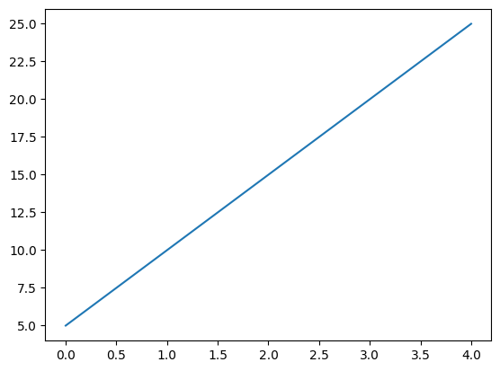

{
  "title": "This is a test to test whether the code is working or not",
  "author": {
    "name": "David Meszaros"
  },
  "date": "2024-10-02",
  "type": [
    "post",
    "posts"
  ]
}
Testing markdown, to see whetehr it renders correctly in the browser.

## Test 1

```python

print("Hello World")

def test():
    print("Hello World")

class HelloWorld:
    def __init__(self):
        print("Hello World")

```

### Math

$$ x = \frac{-b \pm \sqrt{b^2 - 4ac}}{2a} $$


    

    


    ['test.png', 'test_copy.png']


