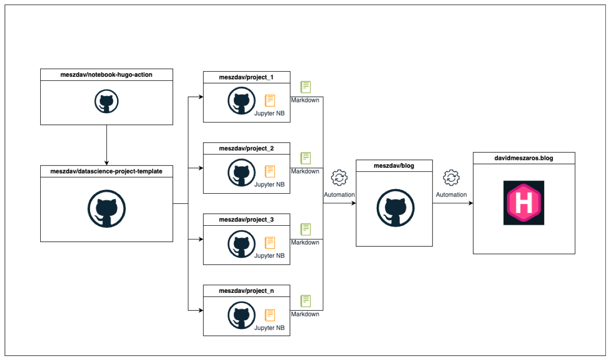

{
  "title": "Publish jupyter notebooks as blog posts",
  "author": {
    "name": "David Meszaros"
  },
  "date": "2024-10-02",
  "type": [
    "post",
    "posts"
  ]
}
I have just started sharing my work through a blog. Currently, I am following the “one GitHub repo per project” strategy. However, for my hobby projects, using a monorepo approach might make it easier to publish my work. With everything in one place, the deployment process would be simpler, additionally it could be easier to reuse code across projects, and I could just set up one development environment too.

Despite of this, it’s not the right approach for me 😀. I prefer to keep projects separate. I enjoy giving each data science project its own GitHub repository because it makes the code easier to share, and I don’t have to worry about repository size. For me, it makes more sense to keep each project in its own logical unit, even if this is subjective—it’s just the way I prefer to work.

- I might not want to share every project
- I might want specific automation for individual ones.
- Plus, a monorepo could quickly grow in size, making it harder to manage. 

For these reasons, I’ve decided to adopt the following approach:
- One repository for all my blog posts
- One repository for each data science project
- A template repository for new data science projects

My goal is to publish my hobby projects with minimal effort. The first time I published my work, I had to create a notebook with all the code and explanations just to generate the final markdown file. Afterward, I had to copy the markdown from the project’s repository to the blog repository. This process is tedious and time-consuming.

    

    

